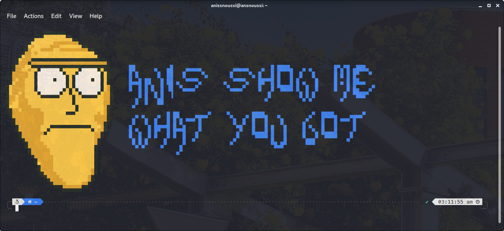
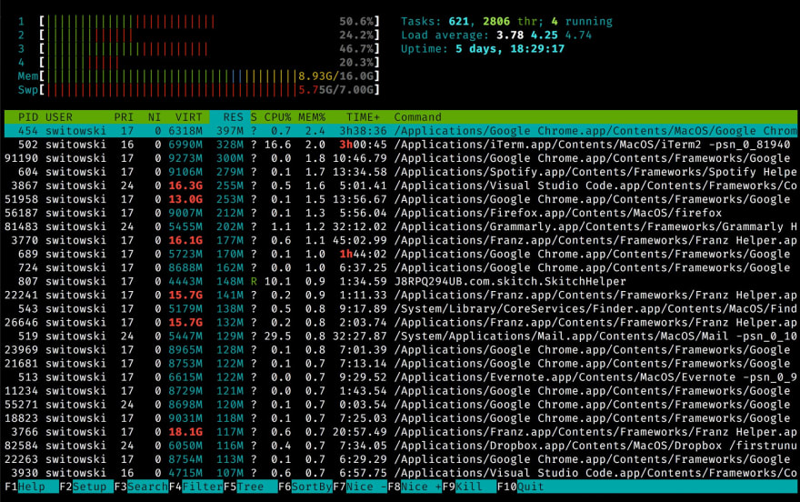
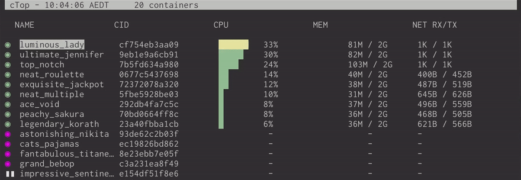
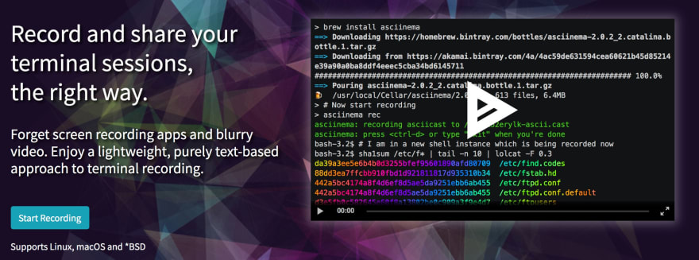
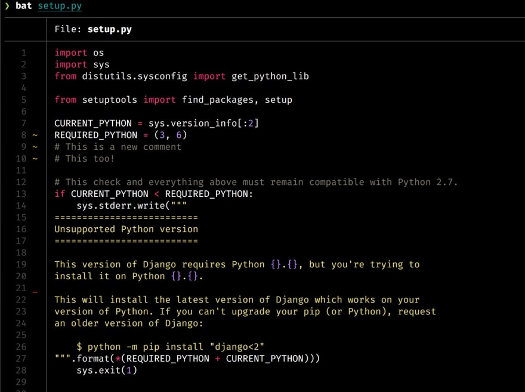
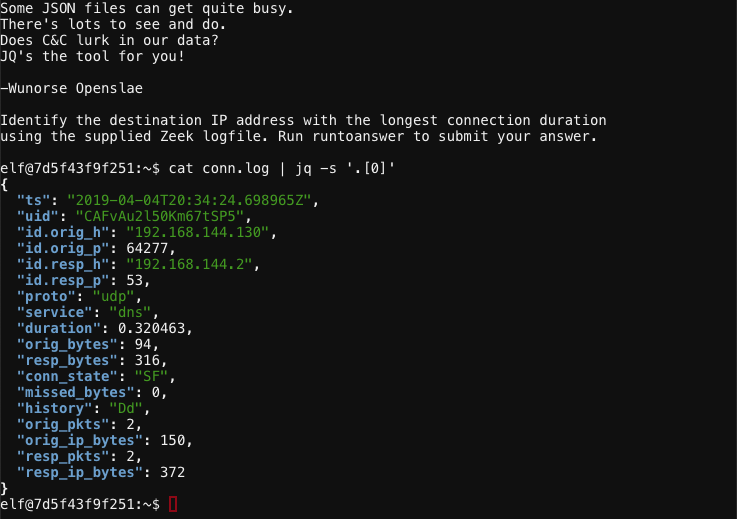

# My Terminal Setup

This repo is meant to keep track of the dirrefent CLI tools that made my life easier for future reference.

## What terminal tho ?

I use ZSH terminal because it offers a variety of plugins and themes that will definitely appeal to all tastes. <br>
I also use [Oh My Zsh](https://github.com/ohmyzsh/ohmyzsh) which is a framework for managing your zsh configuration with sevral plugins andthemes. <br>
And to finish, I am rocking [Powerlevel10k](https://github.com/romkatv/powerlevel10k) as my theme becuase it doesn't only look cool, but it's a great help when dealing with git repos.


## The cherry on top

Everytime I open my terminal I'm greeted with this AWEOSME Rick and Morty that I made myself (check it [here](startup)), I hope you'll appreciate this, even if you're not a fan of the animated tv show.


OLD | NEW
------------ | -------------
 | 


## What I'm using

- **FZF**
   <br>
  FZF stands for “fuzzy finder”. It’s a general-purpose tool that lets you find files, commands in the history, processes, git commits, and more using a fuzzy search.

- **TMUX**
   <br>
  Tmux is a terminal multiplexer for Unix-like operating systems. It allows multiple terminal sessions to be accessed simultaneously in a single window.

- **ripgrep**
   <br>
  Ripgrep is an alternative to the grep command - **much faster one**, with sane defaults and colorized output. <br>
  It skips files ignored by .gitignore and hidden ones
- **htop**
   <br>
  To put it as simple as possible, htop is top on steroids - colorful, with plenty of options, and overall more comfortable to use.
- **ctop**
   <br>
  ctop is a top-like interface for Docker containers. It gives you:
  - A list of running and stopped containers
  - Statistics like memory usage, CPU, and an additional detailed window for each container (with open ports and other information)
  - A quick menu to stop, kill, or show logs of a given container
- **Lazy Docker**
   <br>
  It’s a full-fledged terminal UI for managing Docker with even more features.
- **Asciinema**
   <br>
  asciinema is a tool that you can use to record your terminal sessions. But, unlike recording GIFs, it will let your viewers select and copy the code from those recordings!
- **Tree**
   <br>
  If you want to present the content of a given directory, tree is a go-to tool to do that. It displays all the subdirectories and files in a nice, tree-like structure:
- **Bat**
   <br>
  Like cat but better, adds syntax highlighting, git gutter marks (when applicable), automatic paging (if the file is large), and in general, makes the output much more enjoyable to read.
- **Xclip** <br>
  xclip provides a conduit between commands you run in a terminal window and the clipboard in a Linux graphical desktop environment.
  I use these aliases to copy and paste to the terminal
  ```
  #copies the piped input onto the clipboard 
  alias copy="xclip -selection c"
  #pastes the clipboards contents into the terminal
  alias paste="xclip -selection clipboard -o"
  ```
- **jq** <br>
   <br>
  jq is like sed for JSON data - you can use it to slice and filter and map and transform structured data with the same ease that sed , awk , grep and friends let you play with text.
  + to beautify json:
  `
  $curl 'http://exmaple.com/api' | jq .
  `
  + get a specific node:
  `
  ... | jq .node_name
 `
  